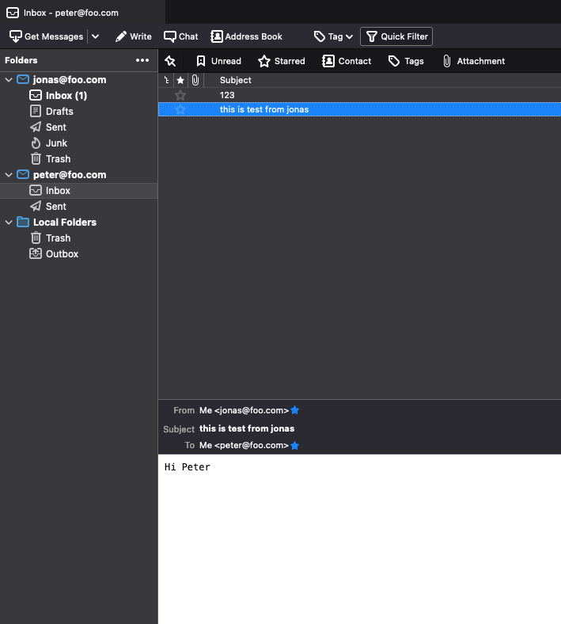

This is inspired by [Docker Mailserver](https://github.com/docker-mailserver/docker-mailserver), and amend to accomdate our requirements.

# Which POSTFIX?

Edit `docker-compose.yml` to your liking

```yaml
      args:
        DEBIAN_VERSION: "11-slim" # postfix 3.5.6
        # DEBIAN_VERSION: "10-slim" # postfix 3.4.14
```
# Create a docker-compose Environment

1. [Install the latest docker-compose](https://docs.docker.com/compose/install/)
2. Edit `docker-compose.yml` to your liking
  * substitute `mail` (hostname) and `foo.com` (domainname) according to your FQDN
3. If the FQDN is artificial, please do remember add domain name into /etc/hosts
4. Configure the mailserver container to your liking by editing mailserver.env ([Documentation](https://docker-mailserver.github.io/docker-mailserver/edge/config/environment/)), but keep in mind this .env file:
  * [only basic VAR=VAL](https://docs.docker.com/compose/env-file/) is supported (do not quote your values!)
  * variable substitution is not supported (e.g. 🚫 OVERRIDE_HOSTNAME=$HOSTNAME.$DOMAINNAME 🚫)

# Get up and running

## Build docker image

Execute the command to build docker image `docker-mailserver`

```
docker-compose build
```

## Starting for the first time

On first start, you will likely see an error stating that there are no mail accounts and the container will exit. You must now do one of two things:

1. Use setup.sh to help you: ./setup.sh email add <user@domain> <password>. You may need the -c option to provide the local path for persisting configuration (a directory that mounts to `/tmp/docker-mailserver` inside the container). This will spin up a new container, mount your configuration volume, and create your first account.
2. Execute the complete command yourself:

```
# create mail account user/password
docker run --rm -v "${PWD}/docker-data/dms/config/:/tmp/docker-mailserver/" docker-mailserver setup email add <user@domain> <password>
# list all email accounts
docker run --rm -v "${PWD}/docker-data/dms/config/:/tmp/docker-mailserver/" docker-mailserver setup email list
```

Make sure to mount the correct configuration directory.

3. Execute the command to start container

```
docker-compose up -d
```

# Desktop Mail Client

Any modern desktop mail client installed on the host should be able to connect to this Postfix server, in this example we will use [Mozilla Thunderbird](https://www.thunderbird.net/en-US/).

1. Create an (or mutiple) email account which was created in POSTFIX mail server.
2. Write an email to the account which was created in POSTFIX mail server.


